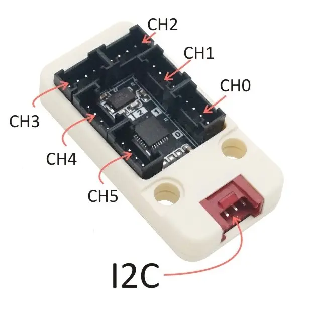

# myCobot用フェーダーコントローラ

<div align="center">
    
    <p>myCobot用フェーダーコントローラ</p>
</div>


[M5Stack](https://m5stack.com/)社の[Pb.Hub Unit](https://shop.m5stack.com/products/pb-hub)に[Fader Unit](https://shop.m5stack.com/collections/m5stack-new-arrival/products/fader-unit-with-b10k-potentiometer-sk6812)（フェーダーユニット）を6つ接続し，[Elephant Robotics](https://www.elephantrobotics.com/en/)社の[myCobot 280](https://www.elephantrobotics.com/en/myCobot-en/)の6つのジョイントを動かすプログラムです。

## 必要なもの

* [myCobot 280](https://www.elephantrobotics.com/en/myCobot-en/) x 1  
  * AtomMain 3.2以降
* [Pb.Hub Unit](https://shop.m5stack.com/products/pb-hub) x 1
* [Fader Unit](https://shop.m5stack.com/collections/m5stack-new-arrival/products/fader-unit-with-b10k-potentiometer-sk6812) x 6

## インストール

[PlatformIO](https://platformio.org/)環境に対応しています。動作確認は Windows 11 上で[PlatformIO IDE for VSCode](https://platformio.org/install/ide?install=vscode)を使用して実施しています。

```
$ git clone https://github.com/3110/mycobot-fader-controller
$ cd mycobot-fader-controller
$ platformio run --target=upload
```

myCobotのM5Stack Basicに書き込む際のシリアルポートは自動判別されますが，うまくいかないときは`platformio.ini`の`upload_port`を設定してください。

## 事前準備

### Pb.Hub UnitにFader Unitを接続する

Pb.Hub UnitにはCH0からCH5まで6つの接続チャネルがあるので，それぞれにフェーダーユニットを接続します。CH0に接続したFader UnitがmyCobotのJ1の操作に，CH1がJ2，CH2がJ3，CH3がJ4，CH4がJ5，CH5がJ6にそれぞれ対応します。

<div align="center">
    
    <p>PbHub Unitへの接続</p>
</div>


### フィーダーの位置合わせ

はじめてフィーダーコントローラを起動すると，フィーダーの位置合わせをするモードになります。

<div align="center">
    
    <p>はじめて起動したときの画面</p>
</div>

各ジョイントの値は，物理的な位置と一致するように下からJ1，J2，J3，J4，J5，J6と並んでいます。

ボタンは向かって左からボタンA，ボタンB，ボタンCと呼びます。
各ボタンの上には必要に応じてラベルが表示されます。以下の図ではボタンAの上にMinというラベルが表示されています。


フィーダーの値はケーブルを差す側が最大値，逆側が最小値，真ん中で止まる位置が中央値になります。

※Fedar Unitから取得できる値は本来は0から4095ですが，Pb.Hub Unitを経由する場合，分解能が10bitのため1024までとなり，出力が5VにもかかわらずFader Unitは3.3Vまでしか出力できないため，1024×(3.3/5.0) = 675.84までになります。

<div align="center">
    
    <p>フィーダユニットの値</p>
</div>

フェーダーの位置は最小値（Min）・中央値（Mid）・最大値（Max）の順に設定していきます。
まずは最小値（Min）を設定します。フェーダのつまみをすべて最小値側に移動させます。

<div align="center">
    
    <p>つまみを最小値の方へ動かす</p>
</div>

ボタンAを押すと，それぞれ各ジョイントの最小角度に設定されます。ボタンAのラベルの表示が最小値を表すMinから中央値を表すMidに変わるので，今度は中央値を設定します。

<div align="center">
    
    <p>最小値の設定完了</p>
</div>

すべてのフェーダーのつまみを中央付近のいったん止まる位置まで動かします。

<div align="center">
    
    <p>つまみを中央に移動する</p>
</div>

ボタンAを押すと，それぞれ各ジョイントの中央値が0に設定されます。ボタンAのラベルの表示が中央値を表すMidから最大値を表すMaxに変わるので，今度は最大値を設定します。

<div align="center">
    
    <p>中央値の設定完了</p>
</div>

すべてのフェーダーのつまみを最大値側に動かします。

<div align="center">
    
    <p>つまみを最大値側に移動する</p>
</div>

ボタンAを押すと，それぞれ各ジョイントの最大値が設定されます。

<div align="center">
    
    <p>フェーダーの位置合わせ完了</p>
</div>

ここで設定した値は，M5Stack Basicの不揮発記憶（NVS: Non-Volatile Storage）に記録されるので，電源を切っても設定が残ります。同じFader Unitを同じ場所につないでいる限りは再度設定する必要はありません。

これでフェーダーでmyCobotを動かす準備が整いました。

## 使い方

フィーダーの位置合わせが完了している場合，電源を入れると以下の画面から始まります。

<div align="center">
    
    <p>位置合わせ完了後の起動画面</p>
</div>

フェーダーを動かしてみると，それぞれ対応するジョイントの値が変わるはずです。この状態では実際にはmyCobotのジョイントは動きません。

ボタンA（Set）を押すと，位置合わせをすることができます。位置がうまく合ってないなど，再度位置合わせをしたい場合に押してください。

ボタンB（Start）を押すと，フェーダーで設定されている値に応じてmyCobotが実際に動き出します。指定された値通りに動くので，設定値には注意してください。もう一度ボタンB（Stop）を押すと停止します。詳細は次の「myCobotを動かす」を参照してください。

ボタンC（Free）を押すと，myCobotのジョイントをすべて脱力させて手で自由に動かせるようになります。ボタンBで停止させたときにmyCobotに無理な力がかかるような動きになってしまって止めたい場合などに使用します。
### myCobotを動かす

初めてボタンBを押してmyCobotを動かすときは，フェーダーのつまみをすべて中央にします。
フェーダーのつまみをすべて中央にするとmyCobotが直立するので，安全に動かすことができます。

<div align="center">
    
    <p>すべてのフェーダーのつまみを中央にする</p>
</div>

ボタンB（Start）を押すと，myCobotがフェーダーで設定した値の通りに動きます。試しにJ6のフェーダーを動かしてみてください。myCobotの手先が動くのがわかると思います。

<div align="center">
    
    <p>myCobotを動かす</p>
</div>

物にぶつかるかどうかなどには関係なく，myCobotはフェーダーで指定された位置に動きます。設定した値によってはmyCobotに無理な力がかかって壊れる可能性もありますので，動かす場合は細心の注意をはらってください。

フェーダーに合わせて動かないようにするには，再度ボタンB（Stop）を押します。
